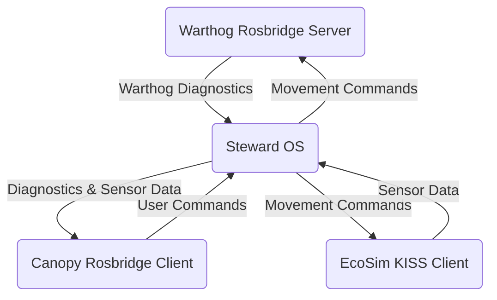

## Bridges

Nodes within Steward OS communicate internally using ROS2 (Fast DDS protocol). However, Steward uses three significant subsystems that do not run ROS2:

1. Our Clearpath Warthog base, which runs ROS1
2. Our simulator, EcoSim
3. Our web interface, Canopy

## KISS Bridge
The Keep It Simple, Stupid (KISS) bridge is a minimal, WebSocket-based bridge that we've designed to transfer large data payloads quickly. Specifically, we use KISS to send image streams and point clouds from EcoSim to Steward OS. We initially implemented a [rosbridge](https://github.com/RobotWebTools/rosbridge_suite) client in C#, but Unity's JSON serialization tools ended up being far too slow.

## Rosbridge
Steward OS communicates both with the Warthog base and Canopy using Rosbridge, a standardized WebSocket [protocol](https://github.com/RobotWebTools/rosbridge_suite/blob/ros2/ROSBRIDGE_PROTOCOL.md).

The Warthog hosts a Rosbridge server, which Steward OS connects to as a client.

Steward OS hosts its own Rosbridge server, which Canopy connects to as a client.

Steward OS combines its client (for connecting to the Warthog) and its server (for connecting to Canopy) in its `web_bridge` package.
